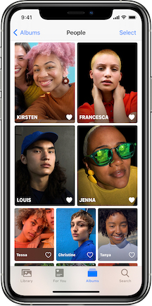
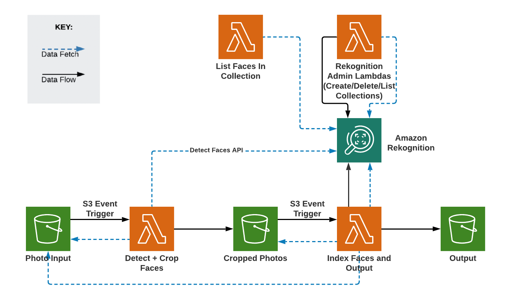
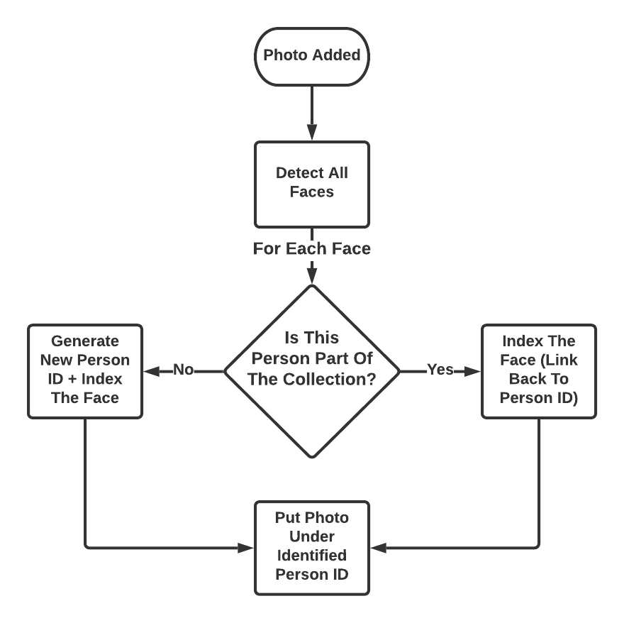

# Recreating Apple's People Album Using Amazon Rekognition (With Support For Individual And Group Photos)

## Idea:

Apple's photos app has a pretty cool feature called the "People album" that groups photos together depending on who is in it.

For example, the photo below is a view of the People album - selecting "Kirsten" will show all the photos where
"Kirsten" has been identified.

I wanted to make something similar using Amazon Rekognition's face detection, indexing, and searching capabilities and support both
individual and group photos.

## Key Words:
`Collection` - A collection is where you can store information about faces and where you can search for matching faces.

`Index` - Every face that you want added to the collection will be indexed == face identified and added to the face collection.

`Face ID` - Every individual face in the collection will be assigned a unique Face ID.

`Person ID` - Every individual person who gets indexed in the collection will be assigned a unique Person ID.

`Note on Face ID vs. Person ID` - As you will see below, the face collection will be dynamic, meaning that as photos get added
then more images/faces will be indexed. So, if I add 5 photos of myself, then all those photos will
be indexed and added to the collection leading to 5 unique `Face IDs`. But, since all the images are of me, they will all be linked
back to 1 unique `Person ID`.

## Architecture Diagram:

<b> Note - </b> The diagram shows 3 S3 buckets, but in reality, I only used one bucket with each of the
three instances shown being a different directory (input/, crop/, output/). Just made the diagram clearer
to put them as three different buckets.

## Purpose Of Each Lambda:

What exactly does each Lambda do?
### Rekognition Admin Lambdas:
1. <b> Create Collection - </b> Creates a Rekognition collection
2. <b> Delete Collection - </b> Deletes a Rekognition collection
3. <b> List Collections - </b> Lists all Rekognition collections

### List Faces In Collection:
Lists all Face IDs and associated Person IDs for items in the collection

### Detect + Crop Faces:
<b> Trigger: </b>

A photo is placed in the `input` directory of the S3 bucket  

<b> Process:</b>

1. Get the original photo from the input folder

2. Call out to Rekognition to detect all the faces in the photo

3. Crop the photo down to a series of faces and put them in a `crop/copped-faces/{{Photo Name}}` folder and tag it with the original photo key
4. Draw boxes around the identified faces to show what is being cropped and put that in a `crop/idenitified-faces/{{Photo Name}}` folder for reference

<b> Note - </b> It isn't necessary to include this Lambda and output cropped/identified faces. It is used here to show the intermediate
functionality/process behind the scenes. The functionality in this Lambda could have been combined with the Index Faces + Output Lambda to eliminate extra
steps shown

### Index Faces + Output:
<b> Trigger: </b>

A cropped photo of a face is placed in the `crop/cropped-faces/` directory of the S3 bucket  

<b> Process: </b>

1. Get the cropped face from the `crop/cropped-faces/` folder

2. Search the Rekognition collection for the face in the photo

3. If there is a match, then add the face to the collection and tag with the found `Person ID`. If there is not a match, then
generate a new `Person ID` and add the face to the collection and tag with the new `Person ID`
   
4. With help from the tag on the cropped face photo, output the original photo to the identified `Person ID` output directory, which is `output/{{Person ID}}/full-images/`
   
5. For reference, output the indexed image (which is the cropped face image) to `output/{{Person ID}}/indexed-images/`

In the end, the series of `output/{{Person ID}}/full-images/` folders and the images in them will be my version of Apple's People album! 
The `output/{{Person ID}}/indexed-images/` is there for clarity and shows the cropped images that have face metadata contained in the face collection.

## General Algorithm:
This will walk through the generalized logic of the system while ignoring the nitty gritty details.

### Key Takeaways:
1. The face collection will grow and get better with time. Every photo is broken down to a series of faces which 
   will all be indexed. The face recognition that comes right out of the box is pretty good, but as the collection grows, more photos will be added
   for each person leading to, in the long run, a more reliable system.
   
2. There is full support for group photos. Each face that gets detected in a photo will have its metadata indexed appropriately. Out of the box, 
   Amazon Rekognition does a good job of indexing multiple faces from a group photo as well as identifying who is in a group photo given an already populated collection.
   However, it does nothing to support pulling apart a photo to see who is already in the collection versus who is not and allowing for appropriate indexing and person referencing.
   This portion was largely the motivator for this project.
